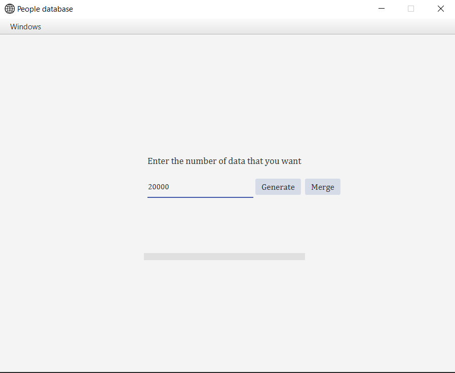
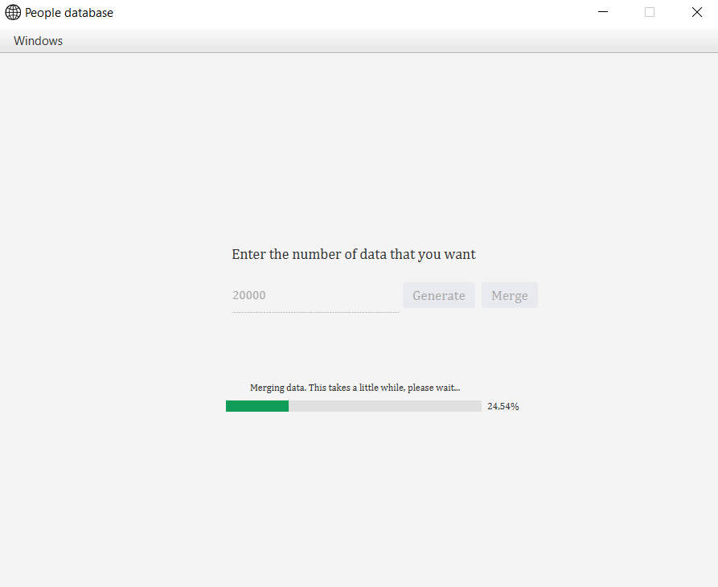
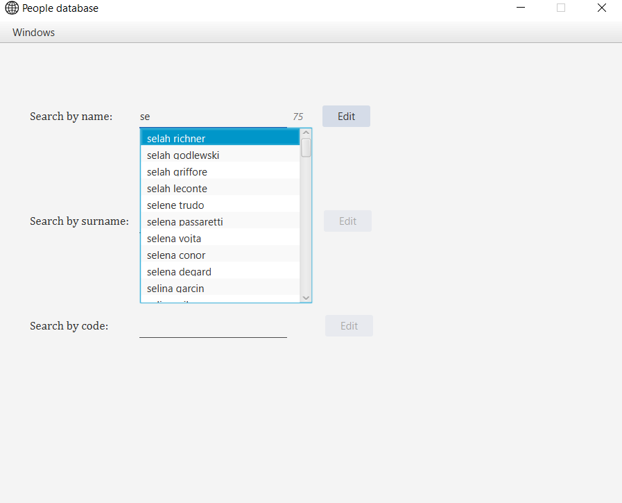
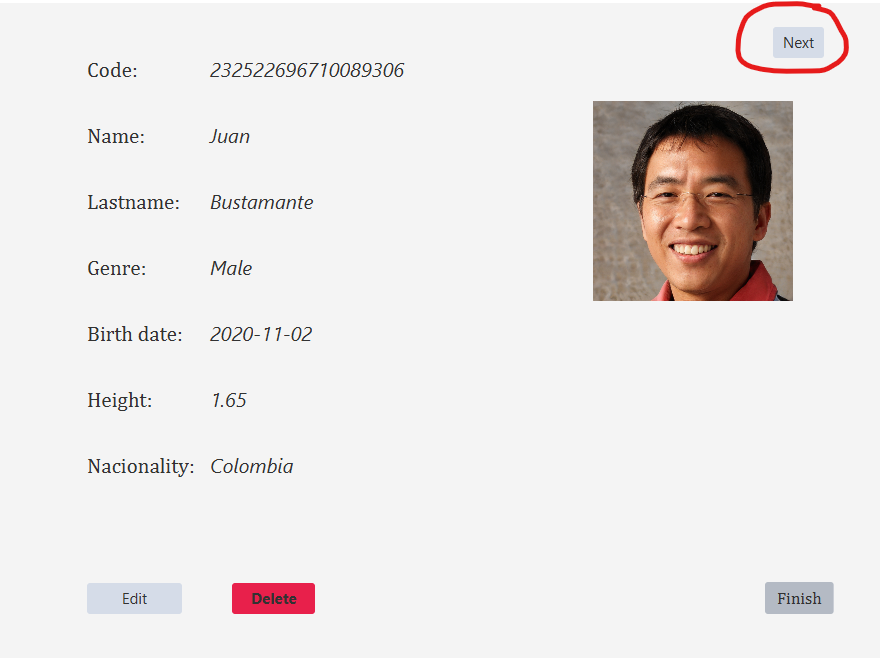
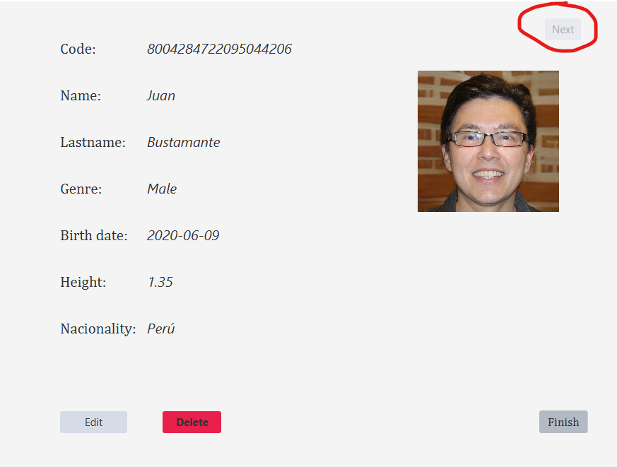
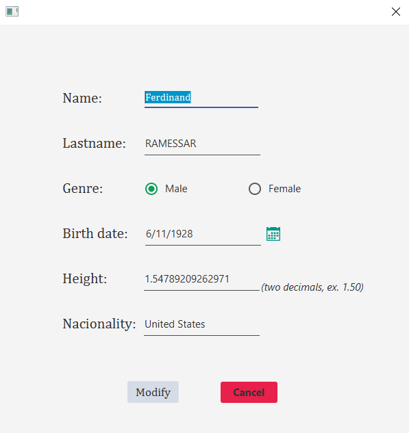
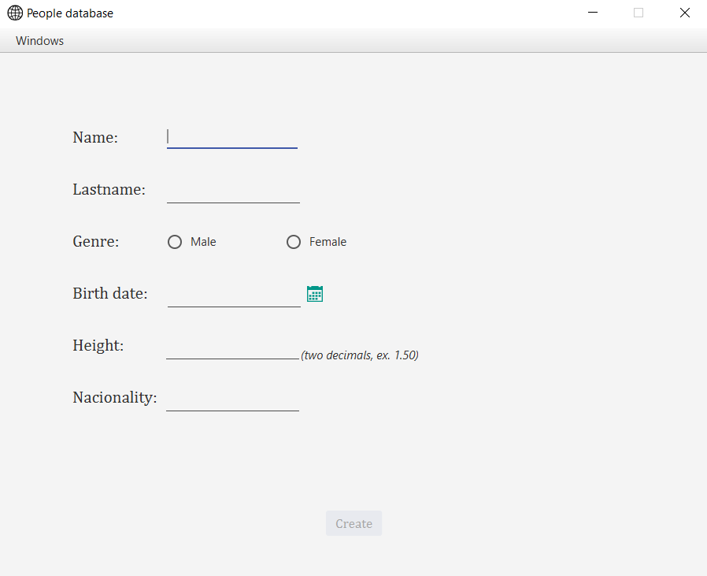

# People Database

_People Database is a tool to automatically generate and manage large amounts of people._

## Getting started 🚀

### Pre-requirements 📋

**Libraries**

The project makes use of the next libraries, make you sure you have them installed:

* [JFoenix](https://github.com/jfoenixadmin/JFoenix) for java 8.

**The _dist\_files_**

To generate people, the software uses some files to _know_ how to distribuite some fields such as age and nationality. Those .csv are formatted in a simple way:

```
value,percent_of_the_total_amount,cumulative_sum_of_share
```

It is **tremendously** important that these files are sorted ascendingly per percent\_of\_the_\total\_amount column. Here are some rows from one of our files as an example:

```
#country,share,cumulative
United States,32.49940048339738,32.49940048339738
Brazil,20.87452476741409,53.37392525081147
Mexico,12.669177190154134,66.0431024409656
Colombia,4.999976606861676,71.04307904782728
Argentina,4.440032268602899,75.48311131643018
Canada,3.7075335704040726,79.19064488683425
Peru,3.241711352546825,82.43235623938108
```

## A walk through the GUI 🖥️

When you execute the program you are meet by the **generate screen**. Here you can randomly create people and merge them into te AVL trees.
**IT IS IMPORTANT TO MERGE AFTER GENERATING PEOPLE, OTHERWISE YOU WOULD NOT BE ABLE TO MANAGE THEM**

_It can generate 10 million people in approximately 1 minute, but merging is way slower._




Once you have generated and merged some people, you can go to the search tab and edit some of them: 



If you click on the edit button on the previous screen, you will see another window with more info about this person.

_Note that: if you have more than one person with the same name (read compound name or reverse compound name), a little 'next' button would be available to navigate
through them without having to go back and search per code._



_'Previous' button soon ;)_



In this screen, you can also delete this person from the database; or edit them, opening the modify screen:


Last, you can create register some people from the Add Tab:


## Documentation 📖

* [Main doc](docs/DOCUMENTATION-TI2.pdf)
* [Docs folder](/docs)

## Authors ✒️
* [sebasjarat03](https://github.com/sebasjarat03)
* [bjuan210302](https://github.com/bjuan210302)
